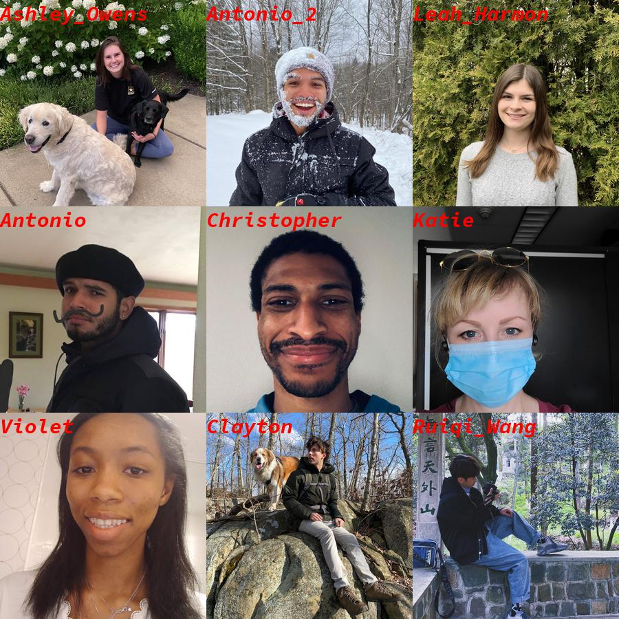

## How do I use GitHub?


## Things you need to do to get started:

- Create an account in github: [link](https://github.com/join) 
- Install github (please follow the instructions for your OS): [link](https://github.com/git-guides/install-git)
- Create a personal token [here](https://docs.github.com/en/github/authenticating-to-github/keeping-your-account-and-data-secure/creating-a-personal-access-token) 

### Getting & Creating Projects

| Command | Description |
| ------- | ----------- |
| `git init` | Initialize a local Git repository |
| `git clone ssh://git@github.com/[username]/[repository-name].git` | Create a local copy of a remote repository |

### Basic commands

| Command | Description |
| ------- | ----------- |
| `git status` | Check status |
| `git add [file-name.txt]` | Add a file to the staging area |
| `git add -A` | Add all new and changed files to the staging area |
| `git commit -m "[commit message]"` | Commit changes |
| `git rm -r [file-name.txt]` | Remove a file (or folder) |

For a more complete cheat sheet, check the [link](https://education.github.com/git-cheat-sheet-education.pdf)

### Let's try it out! 
1. Fork this repository (check here for more details) [link](https://docs.github.com/en/get-started/quickstart/fork-a-repo))


2. Clone your repo:
```bash
git clone https://github.com/YOUR-USERNAME/INP_Git_Intro.git
```
You can obtain the correct url for your fork like shown below


3. Get into the folder:
```bash
cd INP_2021_Git_Intro
```

4. Add a photo of you to `photos` with the filename as `Firstname_Lastname.jpeg` (please, use <span style="color:blue"> jpeg</span>.)

5. Check your modifications
```bash
git status
```

6. Add your modifications
```bash
git add -A
```

7. Commit your changes
```bash
git commit -m "[commit message]"
```

8. Push your changes
```bash
git push
```

9. Create a pull request back to Antonio's repository. We will make a collage with the photos of the people who completed this tutorial! :)


10. Here is the collage from the previous year!


